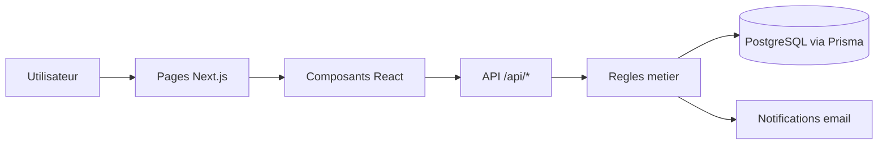
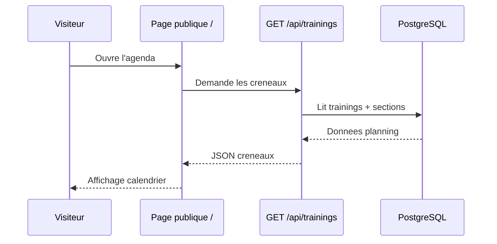
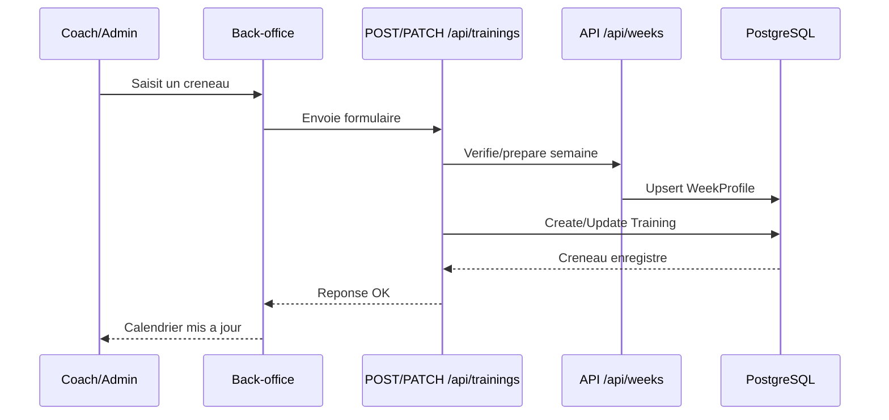
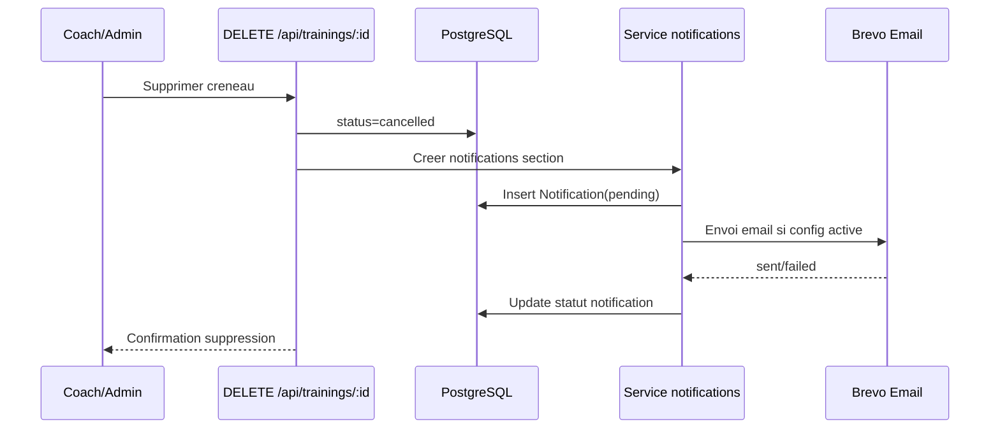
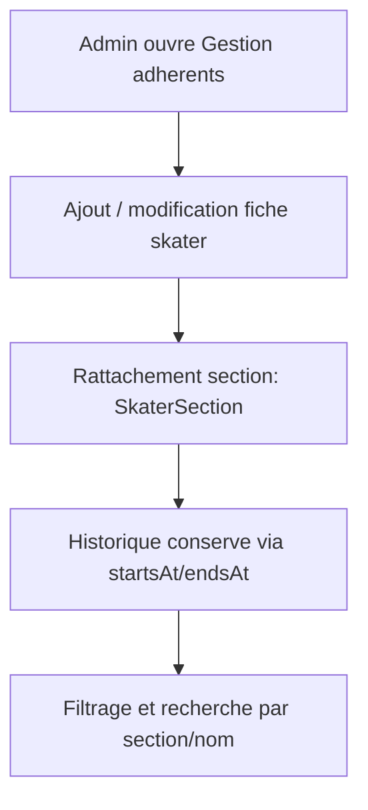
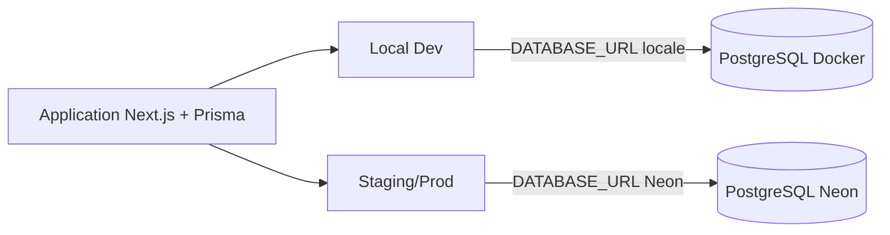

# Flux visuel simplifie - EPWLM Planning

Ce document propose des schemas simples pour comprendre rapidement le fonctionnement global.

## 1) Vue d'ensemble

## 2) Parcours agenda public

## 3) Parcours coach/admin - creation ou edition

## 4) Suppression et notifications familles

## 5) Gestion adherents

## 6) Environnements de base de donnees

## 7) Rappel des regles metier importantes

- Les ecritures de planning necessitent une session connectee.
- Les creneaux annules sont exclus de l'affichage public.
- Une semaine STANDARD vide peut heriter les creneaux de la precedente semaine STANDARD.
- Les notifications sont tracees en base avec statut (`pending`, `sent`, `failed`).
